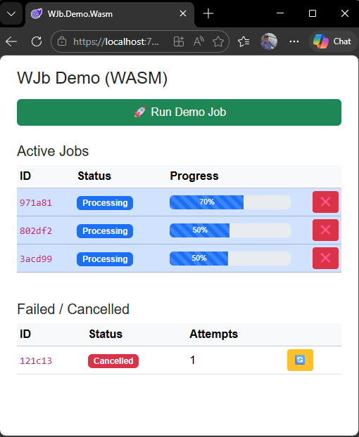

# WJb Samples

This folder contains runnable examples demonstrating how to use **WJb** in different environments.

---

---
## 📦 Available Samples

### 🔹 WASM Demo

📁 `WJb.Demo.Wasm`

A client-side Blazor WebAssembly demo showing:

- Job queue in browser
- Live progress updates
- Retry for failed / cancelled jobs
- No server required

#### Features

- Active jobs view (queue)
- Failed / Cancelled jobs with retry
- Progress tracking
- In-memory execution

#### Run

```bash
cd samples/WJb.Demo.Wasm
dotnet run
```

Open:

```
https://localhost:xxxx
```

***

### 🔹 Full Demo

📁 `WJb.Demo.Full`

A full-stack demo (Server + Worker) showing:

* Background worker loop
* Concurrent job execution
* Retry middleware
* Queue + History lifecycle

#### Features

* Worker-based processing
* Configurable concurrency
* Retry handling
* Real job lifecycle:
  ```
  Queued → Processing → Completed / Failed / Cancelled → History
  ```

#### Run

```bash
cd samples/WJb.Demo.Full
dotnet run
```

***

## 🧠 What These Samples Show

Together, the samples demonstrate:

* Job execution without infrastructure (WASM)
* Real background processing with workers (Full)
* Retry model and lifecycle behavior
* Queue vs History separation
* Progress reporting and UI integration

***

## 🎯 When to Use Which

| Scenario                | Sample |
| ----------------------- | ------ |
| UI experimentation      | WASM   |
| Real backend processing | Full   |
| Learning lifecycle      | Both   |

***

## 🔗 Related

* Main library: <https://github.com/UkrGuru/WJb>
* Core concepts: see `WJb.Core`

***

## Philosophy

> WJb is designed to be simple, explicit, and predictable —  
> these samples reflect that approach.

